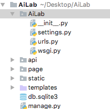
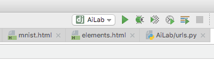
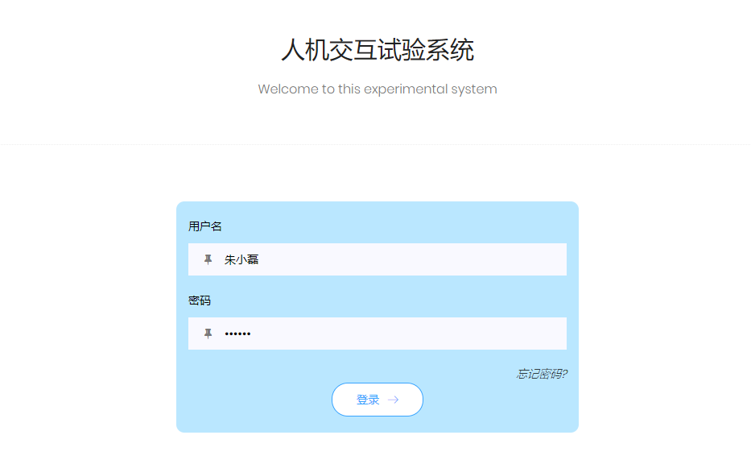
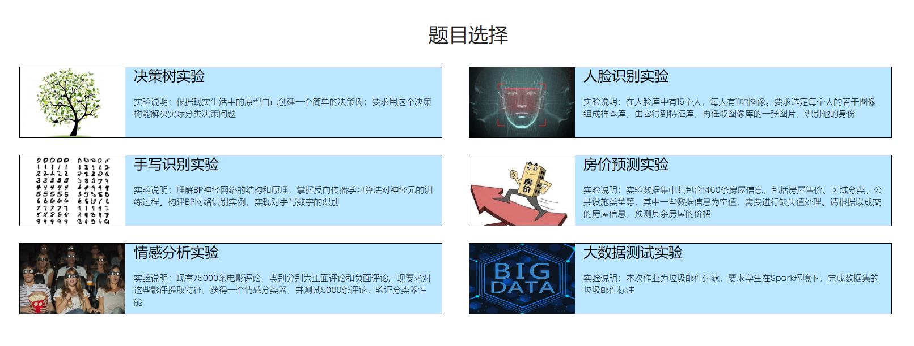
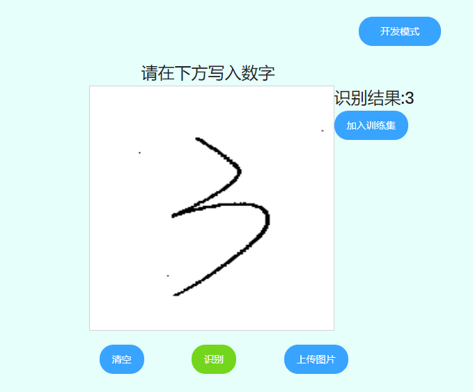
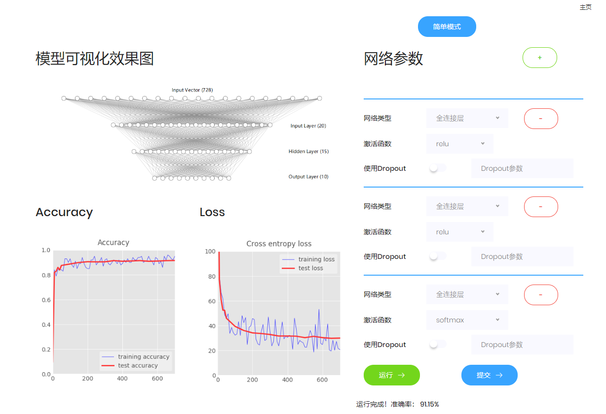
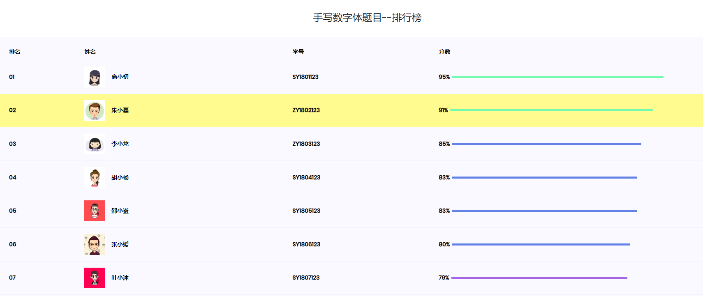

# 手写体数字识别的学生在线实验平台说明文档

## 1. 开发环境

Python解释器版本：3.6.x

依赖库：`django` `pillow` `tensorflow`

IDE：PyCharm

## 2. 开发说明

### 2.1 代码结构

 

一个`Django`项目下可以创建多个 app 以划分不同的功能。目前已经创建好了两个 app ，一个是`api`，负责后端接口；一个是`page`，
负责前端渲染。也就是项目目录下的`api/`和`page/`文件夹。

`static/`文件夹存储静态资源，也就是 bootstrap 模板的资源。

`templates/`文件夹中是前端的 html 代码。

`AiLab/`文件夹中则是与项目相关的配置文件。

### 2.2 手写体识别

我们采用LeNet-5卷积神经网络模型，卷积神经网络能够很好的利用图像的结构信息，每个卷积层有多个卷积核或者过滤器，买个过滤器都有自己所关注的图像特征，比如垂直和水平的边缘、一些纹理等等，这些所有的神经元加起来就可以提取出整张图像的特征集合。以下是LeNet-5的网络结构：

 

##### 第一层，卷积层
输入层，接收原始图像为输入，采用的过滤器的尺寸为5*5，使用全0填充，步长为1，深度为32。

##### 第二层，池化层
采用最大池化，过滤器的尺寸为2*2，同样使用全0填充，步长为2。

##### 第三层，卷积层
过滤器尺寸为5*5，使用全0填充，步长为1，深度为64。

##### 第四层，池化层
最大池化，过滤器的尺寸为2*2，使用全0填充，步长为2。

##### 第五层，全连接层
引入dropout，将其设置为0.5，dropout有助于减少后一层对于前一层过渡的依赖，从而防止网络过拟合，提升性能。

##### 第六层，全连接层
输出层，使用softmax输出预测的概率分布。

我们使用TensorFlow所给出的mnist数据集进行训练，采用Adam的优化方法，在训练数据上的正确率为100%，测试数据上的正确率为99.37%。

### 2.3 前端展示

1. `page/views.py`中定义了视图函数，每个视图函数负责渲染相应的`templates`中的 html 页面。

2. `page/urls.py`负责完成视图函数与 url 的绑定，以便在浏览器中通过 url 访问页面。

3. `templates/`中保存全部前端页面，`login.html`是登录页，`mnist.html`是手写图识别页,`model.html`是模型调参页，
`question.html`是选择题目页，`rank.html`是排名页。如果需要修改这五个页面中的内容，直接修改这个五个 html 文件
即可。如果需要额外添加页面，则需要在`page/views.py`定义对应的视图函数，并在`page/urls.py`中完成视图函数与 url 的绑定。

### 2.4 运行项目

首先把项目 clone 到本地，然后用 PyCharm 打开项目文件夹，如果 PyCharm 识别出这是一个`Django`项目
（ 需要 PyCharm Professional ），如下图所示

 

此时可以直接点击图中绿色的运行按钮，就可以把项目跑起来。

如果 PyCharm 没有识别出这是一个`Django`项目也没关系，在下方 Terminal 中输入`python manage.py runserer`
然后回车也可以把项目跑起来。

项目跑起来之后，在浏览器中访问 [127.0.0.1:8000](http://127.0.0.1:8000) 即可访问项目主页。

如果项目启动失败，可能是由于项目所需的包没有安装，可以在 PyCharm 中检查一下。

## 3. 使用说明

### 3.1 用户登录

启动服务以后，在浏览其中访问 [127.0.0.1:8000](http://127.0.0.1:8000) 即可进入登录页面。

 

输入用户名和密码后点击登录按钮跳转到题目选择页面。

### 3.2 题目选择

 

在选题页面中共有六个问题可供选择，但除手写体识别实验之外，其他实验内容尚未开发完成。

点击手写体识别实验进入手写体识别页面。

### 3.3 手写体识别

 

在这个页面，用户可以直接用鼠标书写数字或者上传图片，点击识别按钮会调用训练好的神经网络模型对输入的图片进行预测。
预测结果显示在右上角，可以选择将该图片加入训练集中。

点击右上角的开发者模式按钮可以进入模型调试页面。

### 3.4 模型调试

 

这个页面主要分为左右两部分，左侧是模型的可视化，右侧是模型参数调节面板。

用户可以更改网络层数，以及每一层的网络类型，激活函数以及 Dropout 选项。在调整模型参数的过程中，模型可视化效果图会实时更新。

模型搭建完毕以后，点击运行按钮可以在当前参数设置下进行（模拟）训练，5秒后训练结束，输出准确率，并在左侧显示 Accuracy 曲线和 Loss 曲线。

此时可以点击提交按钮以提交训练成绩。

### 3.5 查看排名

在排名页面，可以看到所有人的最好成绩，自己的成绩以浅黄色背景突出显示。
